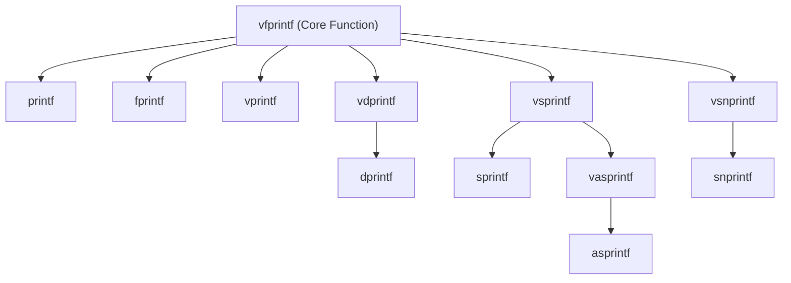

# printf familly dependency

```mermaid
graph TD
    vfprintf["vfprintf (Core Function)"]
    vfprintf --> printf["printf"]
    vfprintf --> fprintf["fprintf"]
    vfprintf --> vprintf["vprintf"]
    vfprintf --> vdprintf["vdprintf"]
    vfprintf --> vsprintf["vsprintf"]
    vfprintf --> vsnprintf["vsnprintf"]
    vsprintf --> sprintf["sprintf"]
    vsnprintf --> snprintf["snprintf"]
    vsprintf --> vasprintf["vasprintf"]
    vdprintf --> dprintf["dprintf"]
    vasprintf --> asprintf["asprintf"]
```
